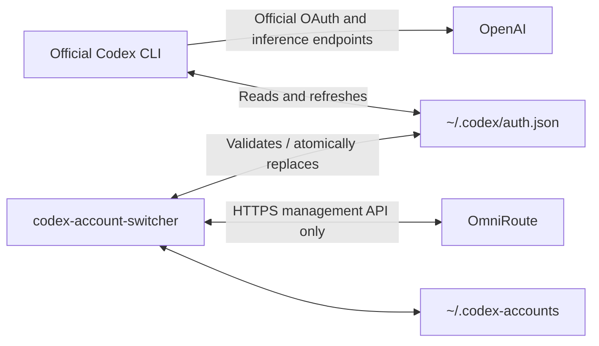

# codex-account-switcher

A local account manager for the **official OpenAI Codex CLI**, with OmniRoute as a credential vault. One normal `~/.codex` home keeps your existing sessions, history, skills, configuration, and resume files shared. The only persistent Codex file this utility replaces is `~/.codex/auth.json`.

**Linux first. Requires Node.js 22.13+ or 24+, `/proc`, and util-linux `flock`.** Windows and macOS mutation support is intentionally blocked until safe locking and process detection backends are implemented. Runtime dependencies: one TOML parser. Tests use fake credentials exclusively.

## Architecture



`Codex CLI → OpenAI` and, separately, `codex-account-switcher ↔ OmniRoute`.

OmniRoute does **not** proxy Codex inference. This program never changes `config.toml`, `model_provider`, any OpenAI base URL, or `CODEX_HOME`. It does not launch Codex with overrides. Existing alternate providers, environment credentials, or non-file credential storage must be resolved by the operator before using this architecture; the program refuses detected incompatible defaults.

File-based OAuth authentication is required. Keyring, auto, ephemeral, API-key, and workload identity authentication cannot be switched reliably through `auth.json`. Managed policies and external CLI/IDE overrides are outside this utility's control; see [compatibility notes](docs/upstream.md). Keeping session files does not grant a new account access to the old account's cloud resources.

We do not use an auth symlink: Codex may atomically replace its auth file during refresh, breaking a symlink-based switch scheme. The utility rejects symlinked/hardlinked credential files and symlinked state/Codex directories.

## Install with npm

Requires Node.js 22.13+ (Node 24 LTS recommended), npm, Linux `/proc`, and util-linux `flock`. Node itself is not bundled.

```sh
npm install --global @devsecopslonghn/codex-account-switcher
codex-account --version
codex-account
```

To upgrade or remove it:

```sh
npm update --global @devsecopslonghn/codex-account-switcher
npm uninstall --global @devsecopslonghn/codex-account-switcher
```

If npm reports that the global executable directory is not on `PATH`, follow npm's instructions or use a Node version manager. The published package includes compiled JavaScript and its runtime dependency, so consumers do not need build tools. The first bare `codex-account` run starts setup when no configuration exists. Installation and setup never change your Codex auth or enable automation.

## Install from source

```sh
git clone https://github.com/devsecopslonghn/codex-account-switcher.git
cd codex-account-switcher
npm ci
npm run check
npm install --global --prefix "$HOME/.local" .
# Ensure ~/.local/bin and your supported Node installation are on PATH.
codex-account --help
```

Use Node 24 LTS where possible. The `check` script typechecks, lints, checks formatting, tests, and builds. No step accesses your real OAuth credentials, enables a timer, or performs a real switch. `npm install` alone does not build; run the build/check command first.

## Prepare OmniRoute as a vault

The integration is verified against [release/v3.8.51 at commit ae2ba358](docs/upstream.md). Accounts must be Codex OAuth connections with **both** `providerSpecificData.workspaceId` and `providerSpecificData.chatgptUserId`. A workspace ID or email alone is insufficient: two users can share a Team/Business workspace. For legacy connections, use OmniRoute's trusted auth import flow to populate per-user identity; resolve duplicates before using this tool.

Use a dedicated vault deployment or connections that are not used for inference, automatic tests, exports, or refreshes by other clients while active locally. On the OmniRoute server, disable proactive Codex/OpenAI refresh using `OMNIROUTE_HEALTHCHECK_SKIP_PROVIDERS=codex,openai` (preserve other entries) or per-connection health-check interval zero. That setting controls the health scheduler, **not every possible refresh source**. Other jobs, probes, explicit exports, and inference can still rotate a token. Audit those consumers separately.

Do not actively use the same OAuth token family on multiple machines. A local lock and ten-minute timer cannot serialize refreshes by an independent remote service. This program does not change server settings on your behalf.

## Management credential bootstrap

Create a dedicated **admin** Access Token (`oma_live_…`) in OmniRoute **Settings → Access Tokens**. Then run `codex-account setup`, or just `codex-account` on first use. The terminal wizard asks for the server URL and token, hides token input, validates the URL, calls OmniRoute's `/api/cli/whoami` to prove admin scope, and lists providers to verify connectivity. Invalid input can be retried. Setup does not import, export, or switch any OAuth account.

The wizard also asks you to create a vault passphrase (at least 12 characters). It encrypts the URL and token with scrypt and AES-256-GCM in a private `~/.codex-accounts/vault-<id>.json` file (0600); `config.json` holds only a random vault ID. Neither the token nor the passphrase goes into `.bashrc`, command arguments, or an environment file. A hash alone cannot work because the CLI must recover the original bearer token to call OmniRoute. The passphrase is required to recover the encryption key after the kernel cache is lost.

On Linux with `keyctl` (from the `keyutils` package), setup keeps the derived key in the current user's kernel keyring. Later CLI processes reuse it without another prompt, including after opening a new terminal. The key is kept in kernel memory, readable by processes running as your user, and disappears when the kernel keyring is cleared or the system reboots. The next interactive command asks for the vault passphrase once; **you do not re-enter the admin token**. If `keyctl` is unavailable, the vault still works but each command asks for the passphrase. Noninteractive commands fail with `VAULT_LOCKED` until an interactive command unlocks it. Do not enable the optional timer unless the session key is available whenever it runs. A fully unattended reboot needs an external hardware/OS secret manager; the CLI cannot safely auto-unlock an encrypted file using only data stored beside it.

Run `codex-account setup` again to replace an expired admin token. It validates the new admin scope before changing the active config; failed validation preserves the old vault. Check `codex-account doctor` after setup. Stop Codex before `use` or `rollback`. The old Secret Service credential-helper configuration remains readable, but the new wizard saves to the encrypted local vault.

Existing explicit credential helpers remain supported: put a nonsecret `baseUrl` and an absolute `credentialCommand` array in mode-0600 `~/.codex-accounts/config.json`. The command must print only the bearer token to stdout, runs without a shell, and has a ten-second timeout. CI/headless services may instead inject `OMNIROUTE_URL` and `OMNIROUTE_MANAGEMENT_TOKEN` from their secret manager; those variables take precedence. Do not put tokens in command arguments, shell history, or committed environment files. The utility does not read OmniRoute CLI's private context/keychain format.

HTTPS is mandatory except for exact loopback `localhost`, `127.0.0.1`, or `::1`, which supports local testing or a trusted SSH tunnel. Plain HTTP to LAN/Tailscale addresses is refused; use TLS or a local tunnel. Redirects are refused. A reverse-proxy path prefix is supported. Never embed credentials in the URL.

The credential needs read access to list providers and admin access for POST import/export. Setup requires an admin Access Token and proves its scope using `/api/cli/whoami`. `doctor` proves authenticated listing; it deliberately does not mutate a credential to probe admin permission for manually configured helpers.

## Commands

All command reports are structured JSON containing only selected metadata; errors have stable category codes and static messages. Exit status is zero for success, one for failure, partial `sync-all` failure, or an unhealthy `doctor`. Conflict warnings on an authoritative active push are reported but do not block that push.

Use `codex-account -h` or `codex-account --help` for the command overview. Every command has its own help, for example `codex-account use -h`, `codex-account use --help`, or `codex-account help use`; these show the same command-specific description, options, examples, and safety notes. `-help` is also accepted as a help alias. `-V` and `--version` print the installed version. Help runs without unlocking the vault or contacting OmniRoute. Invalid arguments print the relevant help command and exit with status 2.

| Command                             | Behavior                                                                                                                                                                           |
| ----------------------------------- | ---------------------------------------------------------------------------------------------------------------------------------------------------------------------------------- |
| `codex-account list`                | List Codex OAuth connections; determine active account from actual local identity.                                                                                                 |
| `codex-account current`             | Validate local auth; show user/workspace, email, expiry, remote match, and synchronization status. Still works with a remote warning when offline.                                 |
| `codex-account sync`                | Cache and import the active local session with overwrite semantics. Never export or replace active auth.                                                                           |
| `codex-account sync-all`            | Push active credentials first, then export inactive accounts into their caches.                                                                                                    |
| `codex-account use <selector> [-f]` | Switch using an exact connection ID, unique ID prefix, or unique case-insensitive name/email. `-f` and `--force` opt into switching while Codex is running.                        |
| `codex-account rollback`            | Restore the most recent valid distinct backup, without loading management credentials or contacting OmniRoute.                                                                     |
| `codex-account doctor`              | Check home, local file/auth configuration, private file permissions, kernel lock availability, management config/auth/connectivity, strong identity/conflict, and Codex processes. |

Exact connection IDs take precedence over names. Ambiguous selectors and duplicate strong identities are rejected. Selecting the already-active account only synchronizes it; it never exports or replaces it. The utility can activate a first account if `auth.json` is absent and the normal Codex directory already exists. It refuses to switch away from a malformed or unmapped current auth; use offline rollback or repair the session first.

States include `ACTIVE_LOCAL`, `AVAILABLE`, `STALE`, `CONFLICT`, `REAUTH_REQUIRED`, and `UNKNOWN`. Displaying local activity does not imply credentials are valid server-side. `current`'s `LAST_SYNC_MATCHES_LOCAL` means exactly that; it is not a live cryptographic comparison to the remote credential.

## Switching and token rotation

Close all Codex CLI, IDE extension/app-server, and desktop Codex processes before `use` or `rollback`. The detector checks current-user Linux processes, including a parent Codex agent. Running `use` from a tool shell inside Codex is expected to be refused. Use `codex-account use --help` for the full syntax.

If closing Codex is impractical, `codex-account use 'person@example.com' -f` (or `--force`) bypasses **only** the running-process check. It still verifies the active file, remote identities, lock, backup, and exact file bytes before replacement. The email must match a unique connection; it is a selector, not the internal user ID used to verify identity. A live Codex process may retain the old account in memory or refresh and overwrite `auth.json` after the switch, so this mode cannot guarantee which account that process uses. Restart every Codex CLI and IDE session immediately after a forced switch and run `codex-account current` again. `rollback` has no force option.

A switch acquires the exclusive kernel lock, checks processes, validates the current auth and target selector, saves current auth to its connection-ID cache, and imports it to OmniRoute. It then exports the target, validates its structure and workspace-plus-user identity, caches it, and makes a secure backup of current auth. Only after these steps does it replace active auth. A final process check and exact comparison with the originally read bytes guard against intervening rotations.

For example, if Codex changed A1 to A2, switching to B pushes A2 first. Switching back later exports A from OmniRoute, which now holds A2 (or a fresh session generated by its export implementation). The import response must refer to the expected existing connection; newly created or mismatched connections are rejected.

Before replacement, any failure leaves active bytes untouched by this utility. Remote import/export and cache changes may already have happened. After rename, a state or durability failure reports `COMMITTED`: the new auth may be active. Inspect `current` before retrying. The actual file always determines local identity; `state.json` is not the authority.

Atomic replacement writes a private random temporary file in the same directory, fsyncs it, renames it, and fsyncs the directory. This briefly creates a staging sibling of `auth.json`; no other existing Codex file is changed. A crash before rename leaves the old file intact; after rename the target file is complete. Abandoned utility staging files are removed at the next locked operation. Kernel locks release on process exit/SIGKILL, so stale owner metadata cannot deadlock the tool. **Never delete the lock file**, because doing so could create two independent lock inodes.

Codex itself does not honor this application's lock. Double process/byte checks narrow races but cannot make an atomic transaction with a process launched by another actor between the final check and rename. Keep Codex stopped throughout switches and do not run other account managers concurrently. Use local filesystems with working `flock`, atomic rename, and fsync, not network mounts with weaker semantics.

## Synchronization and conflicts

Active account authority is always:

```text
~/.codex/auth.json → ~/.codex-accounts/<connection-id>.json → OmniRoute
```

Inactive account authority is:

```text
OmniRoute → ~/.codex-accounts/<connection-id>.json
```

`sync-all` never writes active auth and never exports the active connection. It refuses malformed, unmapped, or ambiguous active identity because it cannot safely choose which account to exclude. Background sync may run while Codex is active. If Codex rotates during the request, the command marks the baseline stale/returns `CHANGED`; the next run pushes the latest bytes. The program never uses or refreshes OAuth tokens directly against OpenAI.

`state.json` stores only connection IDs, identity metadata, synchronization timestamps, token SHA-256 fingerprints, remote revisions, and states. Token fingerprints ignore export's volatile `last_refresh` field. OAuth tokens live only in auth/cache/backup files, never state.

Active conflicts compare the local fingerprint and upstream `updatedAt` to a known baseline. When both change, the program reports suspicious divergence and pushes active local credentials as required. It also warns on a remote-only revision change. Upstream listing omits token hashes, so metadata edits can cause conservative warnings and same-revision remote edits cannot be detected. Import has no server compare-and-swap or connection-ID parameter; a concurrent server editor cannot be coordinated atomically. Inspect the warning, stop independent token consumers, and run `sync` after reconciling; a successful uncontested sync clears the conflict.

Inactive caches changed independently from their known baseline are preserved, even if the remote revision is unchanged. A cache with no known baseline is also preserved. `sync-all` continues other inactive accounts and reports per-account failures with a nonzero exit; `use` refuses the affected target. To resolve, first stop the timer and investigate. If you intentionally want the remote copy, securely remove **only the inactive account's cache file** after confirming its ID and that you do not need its credentials, then run `sync-all`. To preserve the local edit, import it through OmniRoute's trusted UI and resolve duplicates there before deliberately resetting that cache. Do not delete the active auth or all state as a generic fix.

## Backups and rollback

Backups are stored under `~/.codex-accounts/backups`, limited to the newest five files, with directory mode 0700 and file mode 0600. They contain refresh tokens and require the same protection as active credentials. Pruning limits count rather than guaranteeing an age-based expiry or secure physical erasure on SSD/snapshot filesystems.

`rollback` validates candidates newest-first, skips invalid backups, and restores a distinct credential snapshot atomically. It works with malformed current JSON and without a server connection. If current auth is valid, it is preserved in a backup and, when identifiable from state, in its local cache. A consumed backup is removed; repeated rollbacks can alternate distinct saved sessions. Rolled-back state is marked stale until synchronized.

OAuth rotation/revocation cannot be undone by copying a file. An old backup can be structurally valid but unusable with OpenAI. If necessary, reauthenticate through the official Codex/OmniRoute login flow and re-import a fresh session. Do not repeatedly refresh or retry a revoked token family.

## Background sync with systemd

Unit templates are in `systemd/`. Nothing is enabled automatically. Configure a noninteractive secret helper first and check `codex-account sync-all` manually. The supplied executable location matches the installation above. If your Node comes from an interactive-only version manager, add an explicit `Environment=PATH=...` override containing its **nonsecret** binary path, or install a stable system Node. Do not add tokens to units or arguments.

Explicit installation:

```sh
install -d -m 700 ~/.config/systemd/user
install -m 644 systemd/codex-account-sync.service systemd/codex-account-sync.timer ~/.config/systemd/user/
systemctl --user daemon-reload
systemctl --user enable --now codex-account-sync.timer
systemctl --user list-timers codex-account-sync.timer
journalctl --user -u codex-account-sync.service
```

The timer starts after roughly two minutes and then every ten minutes plus up to thirty seconds of jitter. It only runs while the user service manager is available; use your normal system policy for login/linger behavior. Helper/keychain failures are reported safely rather than prompting indefinitely. Simultaneous manual and timer operations compete for the same lock and one fails with `LOCKED`; a later timer run recovers.

Uninstall automation:

```sh
systemctl --user disable --now codex-account-sync.timer
systemctl --user stop codex-account-sync.service
rm ~/.config/systemd/user/codex-account-sync.service ~/.config/systemd/user/codex-account-sync.timer
systemctl --user daemon-reload
```

Disabling automation does not remove cached credentials. Review retention before deliberately deleting the private account directory. Uninstall the executable with `npm uninstall --global @devsecopslonghn/codex-account-switcher`.

## Security and threat model

Trusted components are the current OS user, local filesystem/kernel, optional credential helper, TLS trust store, and authenticated OmniRoute server. An attacker controlling that user, root, the server, or the helper can obtain/replace credentials; this tool cannot protect against them. Management tokens with export permission can retrieve all accessible OAuth sessions. Scope and isolate the vault accordingly.

The client validates structure, required tokens, JWT payloads, account consistency, and user identity before replacing auth. It decodes JWTs for metadata **without signature verification**. Expired target access credentials are refused for activation after export. ID-token expiry alone does not override a current access-token expiry.

Private files require mode 0600 and private state directories 0700; the tool does not silently chmod broad existing credential files. A normal Codex directory may be readable by others but must not be writable by them. Active auth/cache reads reject nonregular files, symlinks, hardlinks, wrong ownership, excessive size, and broad permissions. Strong protections assume trusted parent directories under the normal user home.

There is no telemetry, credential logging, raw HTTP error rendering, or debug token dump. Output selects metadata fields, strips known secrets/JWT-like strings, and JSON-escapes terminal control characters. Unknown exceptions get a fixed message. HTTP requests have a timeout and bounded response body, refuse redirects, and are never automatically retried. A timeout after import/export is an **indeterminate remote result**, not proof that nothing happened.

Auth, caches, and backups necessarily contain plaintext OAuth credentials protected by filesystem permissions; disk encryption and private backup policy remain the operator's responsibility. JS memory cannot guarantee token zeroization, and crash dumps/privileged tracing can expose process memory. The `.gitignore` excludes normal credential/state/artifact paths; never manually add credentials elsewhere in the repository.

## Verification and development

```sh
npm ci
npm run check
npm run build
node dist/cli.js --help
```

Tests start an ephemeral localhost OmniRoute-compatible HTTP server and use temporary home directories. They exercise both switch directions, A2 rotation preservation, malformed and mismatched auth, API errors, locks/concurrent processes, SIGKILL before rename, process refusal, atomic-write failure, backups/rollback, background authority rules, same-workspace users, conflict handling, and secret suppression. They never need OpenAI credentials. See [test coverage](docs/testing.md).

For real verification, stop Codex and other token consumers first. Run interactive `setup`, then `doctor`, then `list` and `current`. Run `sync`, switch to a second known connection with `use`, and check `current`. Start official Codex in the usual environment and verify login/use/resume; exit it before switching back. Compare your configuration/session files before and after if desired. Never print or paste `auth.json`, cache files, exports, or helper stdout. Run `sync-all` manually before enabling automation. Real OpenAI login/inference is intentionally not part of automated verification.

## Troubleshooting and upgrades

- `CONFIG`: validate the private JSON config, URL, absolute helper, environment, and effective file auth mode. This program never rewrites Codex settings to fix incompatibility. Existing forced workspace policies can restrict which accounts Codex accepts; managed overrides require operator review.
- `FILESYSTEM`: check modes/ownership and regular files; use a local filesystem. Resolve symlink/hardlink setups deliberately. Do not loosen permissions to work around it.
- `VAULT_LOCKED`: run `codex-account list` in an interactive terminal to unlock the encrypted vault. `VAULT_UNLOCK_FAILED` means the passphrase was rejected three times; retry carefully. `VAULT_CORRUPT` means the vault file is missing or damaged; restore your backup or rerun `setup` with a valid admin token.
- `NOT_FOUND` / `AMBIGUOUS`: repair missing user metadata or duplicate server connections using trusted OmniRoute tools. Email matching alone cannot fix it.
- `PROCESS_RUNNING`: close Codex and its IDE/app-server processes. For `use` only, `--force` bypasses this check with the live-session risk described above; restart Codex afterward.
- `AUTHENTICATION` / `AUTHORIZATION`: renew the management credential or grant the required scope. Ordinary inference-only keys do not authorize management.
- `REAUTH_REQUIRED` / `REFRESH_FAILED`: reauthenticate that account; leave active auth intact. An export may have attempted a server refresh; do not blindly repeat it.
- `UNAVAILABLE` / `PROTOCOL`: check TLS/server reachability and the pinned API contract. No automatic credential refresh retry occurs.
- `CHANGED`: another process changed active auth; retry `sync` after it settles. `CONFLICT` requires the investigation described above.
- `COMMITTED`: inspect `current`; replacement may already be complete. Use offline rollback if needed, then reconcile remote state.

When upgrading, disable the timer and finish any active operation. Download and verify the new release package, then repeat the offline installation with its filename. For a source installation, update the checkout, run `npm ci && npm run check`, and reinstall. Review the pinned upstream contract and run `doctor` before re-enabling automation. State version 1 is explicit; unknown versions fail closed rather than discarding metadata. Keep credential backups outside git and review state migration instructions for future releases.

## Publishing releases

Pushing an annotated `vMAJOR.MINOR.PATCH` tag triggers the Release workflow. It checks the version, runs quality checks, builds a clean package, verifies offline installation with an empty npm cache, publishes the scoped package to npm with provenance, and attaches the `.tgz` plus `SHA256SUMS` to a GitHub Release. See [release maintenance](docs/releases.md) for npm trusted publishing setup, versioning, manual runs, and recovery.
